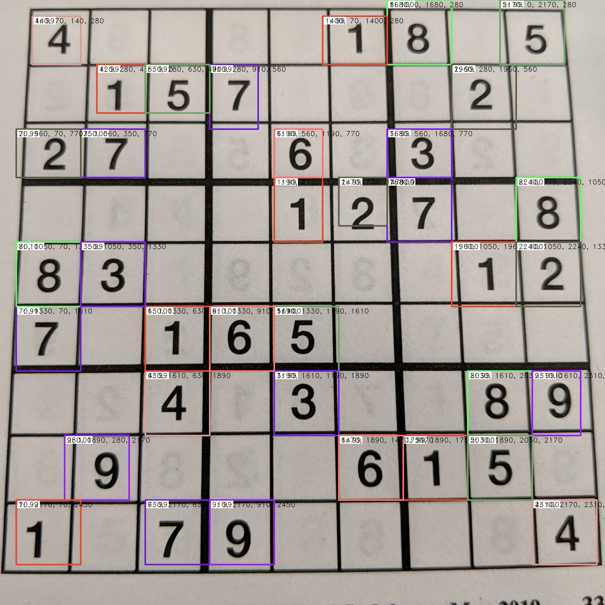

# Sodoku-Image-Recognition
## Use a Neural Net to Interpret and Solve A Sodoku Puzzle

This program leverages a Faster R-CNN network to identify the key values in a picture of a Sodoku puzzle. From there, the values are extracted and used to produce the solution to the puzzle. The first photo shows an example input, the second photo shows the identified bounding boxes and the final photo shows the expected output.

To use this program simply place a single Sodoku image in the input folder. Samples can be found in the samples folder for your convienance. 

<pre>
Usage: main.py [options]

Options:
  -h, --help            show this help message and exit
  -p TEST, --path=TEST  Test File Name
 </pre>
